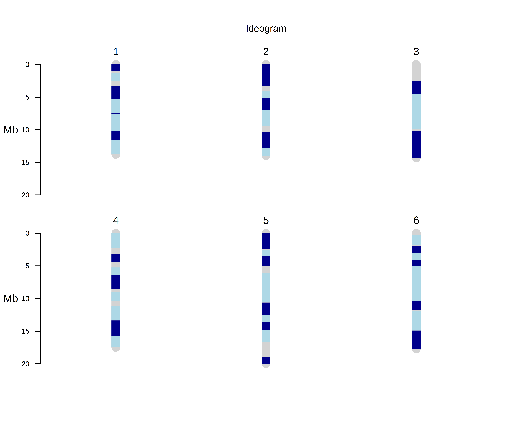

# Visualize Genome Assembly Using Ideogram


## Author
Johnathan Wong

## Description
Frequently, computational biologists would like to visualize the contiguity of the draft genome assembly after genome assembly. One way to do so is through the use of an ideogram using packages like chromPlot[[1]](#1). The process going from draft genome assembly to visualization is not often straightforward and this workflow streamlines the process, making it simple for computational biologists who have no experience to visualize their genome assembly.

### Workflow

The workflow contains 8 steps:

1. Rename the reference using chrN convention, where N is a number. (chromPlot[[1]](#1) often breaks if the chromosome names do not follow the chrN convention).
2. Map the draft assembly to the reference and output a bam file using minimap2[[2]](#2) and samtools[[3]](#3).
3. The bam file is converted to bed file using bedtools[[4]](#4).
4. The bed entries belonging to the top NG`ng` contigs will be selected. (For large genomes, plotting all bed entries can be exceedingly slow).
5. The bed entries are then chained together if they are within some `dist` distances.
6. Bed entries that are subsumed in other bed entries are removed.
7. The bed entries are coloured. The colours will rotate between light blue and dark blue
8. The ideogram is generating using chromPlot[[1]](#1) with the processed bed file as input


### Visualization of the workflow:


### Example output:


The grey bands on the ideogram represents parts of the genome no contigs maps to. The rotating blue colour bands represent the contigs that map the reference genome. Each single colour band represents one contig.

The file will be named as `draft_to_ref.NG95.chained.subsumed.coloured.ideogram.png` if the draft genome assembly is called `draft.fa`, reference genome is called `ref.fa`, and NG`95` contigs were selected.

### Usage

After setting up your config file, simply run
```
snakemake --cores N # N is the number of cores you want to run the script with
```

Configurable parameters can be changed in the config.yaml:
```
draft    path to draft genome assembly # required
ref      path to reference assembly # required
threads  numbers of threads for minimap2 to use to map the draft assembly to reference genome # default: 48
ng       NGXX value to select contigs to plot on ideogram # default: 95
dist     dist between bed entries to chain # default: 50000
```


## Software Requirements

### OS Requirements

GoldRush has been tested on *Linux* operating systems (centOS7, ubuntu-20.04)

### Dependencies
 * [python 3.9+](https://www.python.org/)
 * [minimap2](https://github.com/lh3/minimap2)
 * [samtools](https://github.com/samtools/samtools)
 * [R 4.2.2+](https://www.r-project.org)
 * [chromPlot](https://bioconductor.org/packages/release/bioc/html/chromPlot.html)
 * [biomaRt](https://bioconductor.org/packages/release/bioc/html/biomaRt.html)
 * [snakemake](https://snakemake.readthedocs.io/en/stable/)
 
### Installing dependencies using conda:
```
conda env create -f environment.yaml # environment.yaml can be found in the top dir of this repository. Using the environment.yaml will also ensure maximum reproducibility between users
```
or
```
conda install -c conda-forge -c bioconda r-base=4.2.2 python=3.9 snakemake minimap2 bedtools samtools bioconductor-biomart bioconductor-chromplot
```
## Installation

### Installing from source code:

#### Github repository main branch
 ```
  git clone https://github.com/jowong4/visualize_genome_assembly.git
 ```

#### Downloading release tarball

 ```
  wget https:/jowong4/visualize_genome_assembly/archive/refs/tags/x.y.z.zip
  tar -xf visualize_genome_assembly-x.y.z.tar.gz
 ```

### Testing Installation
 ```
wget https://www.bcgsc.ca/downloads/btl/jowong/biof501/draft.fa # C. elegans draft genome assembly
wget https://www.bcgsc.ca/downloads/btl/jowong/biof501/ref.fa # C. elegans reference genome
# change ref and draft paths in the config.yaml
snakemake --cores 48
 ```
 
Following the commands above will generate an ideogram of a *C. elegans* draft genome assembly against the reference genome. The resulting ideogram should look like this:


## Citations
<a id="1">[1]</a>
Oróstica, K. Y. & Verdugo, R. A. chromPlot: visualization of genomic data in chromosomal context. Bioinformatics 32, 2366–2368 (2016).

<a id="2">[2]</a>
Li, H. Minimap2: pairwise alignment for nucleotide sequences. Bioinformatics 34, 3094–3100 (2018).

<a id="3">[3]</a>
Li, H. et al. The Sequence Alignment/Map format and SAMtools. Bioinformatics 25, 2078–2079 (2009).

<a id="4">[4]</a>
Quinlan, A. R. & Hall, I. M. BEDTools: a flexible suite of utilities for comparing genomic features. Bioinformatics 26, 841–842 (2010).
